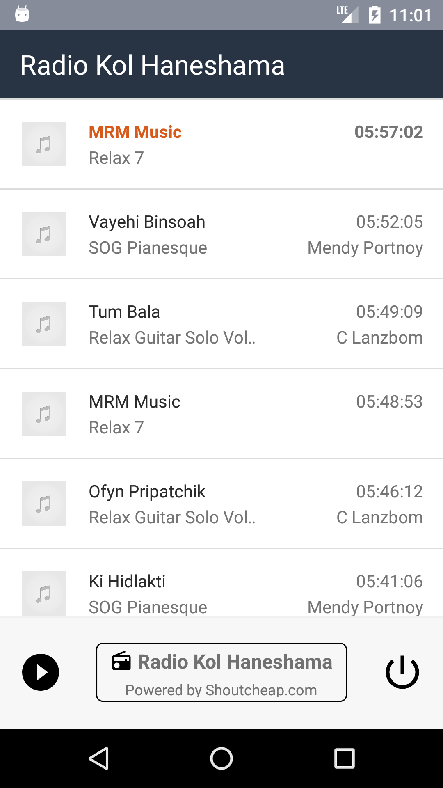
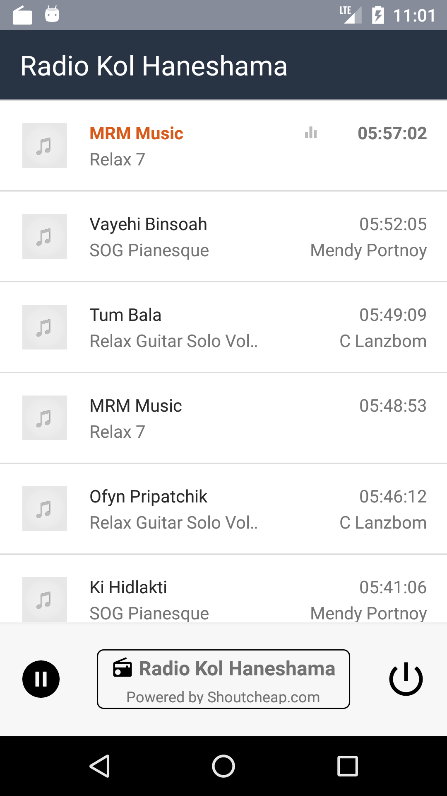
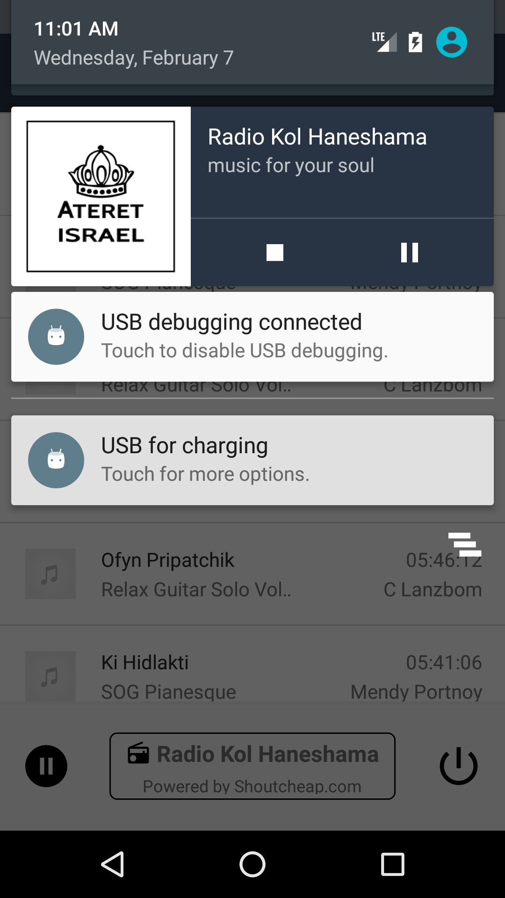
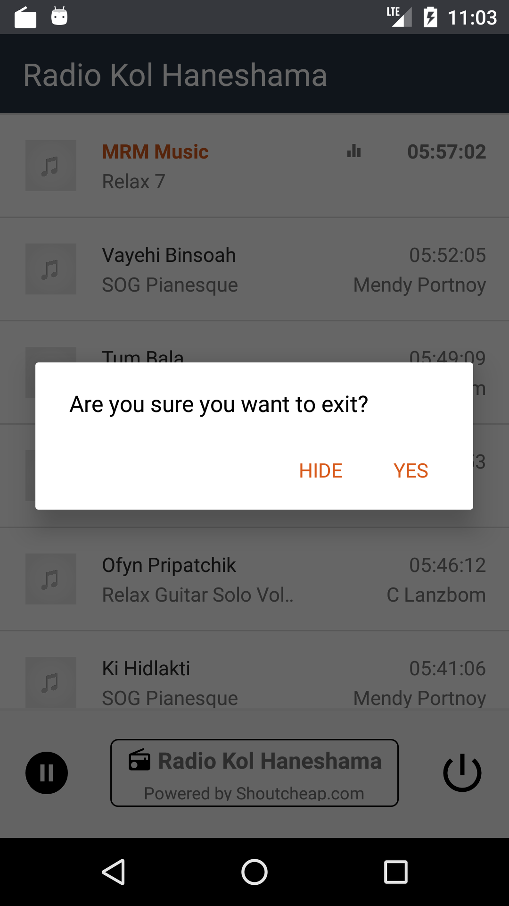
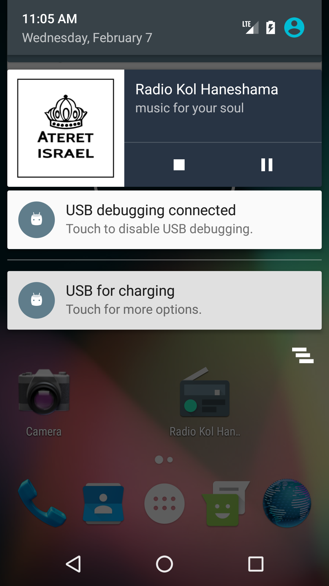

# Radio Kol Haneshama
**Radio on the go!**

Thank you for listening to Radio Kol Haneshama, the only Jewish Radio Station in Southern California broadcasting on FM SCA and online World Wide. Radio Kol Haneshama airs the most updated and upbeat music along with prayers, daily tehilim portions and lectures for all ages.

Download the Radio free app on your Android phone. Once you have downloaded the app, open the app press play and enjoy Radio Kol Haneshama station.

Screenshots
-------------

     

## Radio
[Radio Kol-Haneshama sample-v1.0.0.apk](https://github.com/madbe/RadioKolHaneshama/raw/master/docs/radio-kol-haneshama-sample-v1.0.0.apk)

## Setup

Download the APK file to your mobile and install. You may need to enable Unknown sources in your phone in order to install.

## Author
**Ben Madar**

* [github/madbe](https://github.com/madbe/RadioKolHaneshama)


## License

```
Copyright 2018 madbe

Licensed under the Apache License, Version 2.0 (the "License");
you may not use this file except in compliance with the License.
You may obtain a copy of the License at

   http://www.apache.org/licenses/LICENSE-2.0

Unless required by applicable law or agreed to in writing, software
distributed under the License is distributed on an "AS IS" BASIS,
WITHOUT WARRANTIES OR CONDITIONS OF ANY KIND, either express or implied.
See the License for the specific language governing permissions and
limitations under the License.
```
